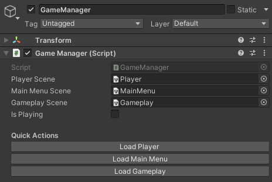
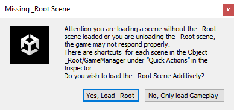

# Ship Game #
This game was made in Unity **2021.3.5f1**.

To start the project open the scene _Root under Assets/Scenes/_Root.scene, the scene only has 2 objects GameManager and EventSystem, if you select the GameManager object you will see shortcuts for the other scenes.

If you try to open a scene without the _Root scene being loaded or if you try to open another scene and unload the _Root scene, the editor will warn you about it.

As long as the _Root scene is loaded you can start the game with any set of scenes, the GameManager will take care to only keep the ones necessary without causing any errors.