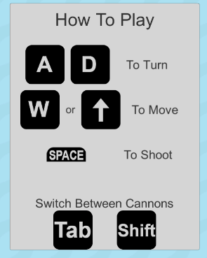
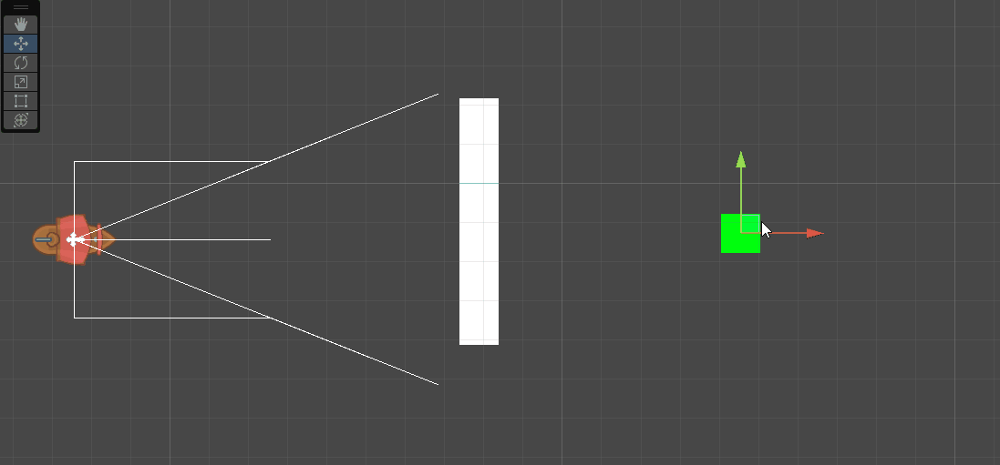
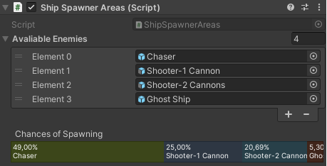
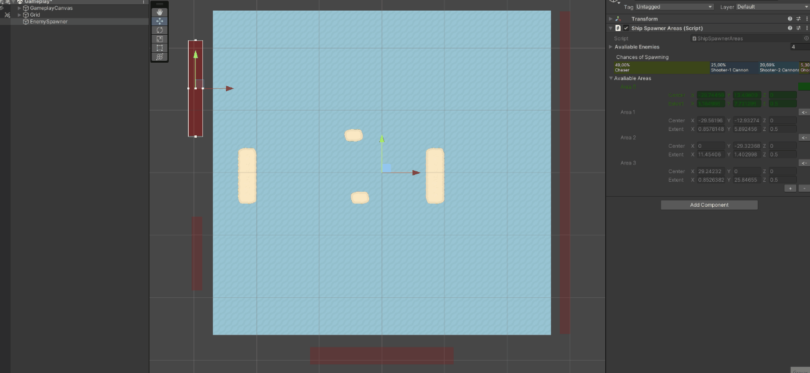
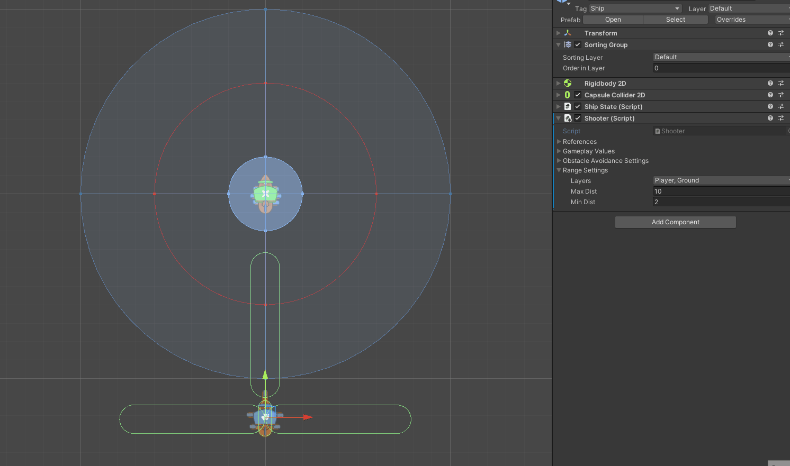
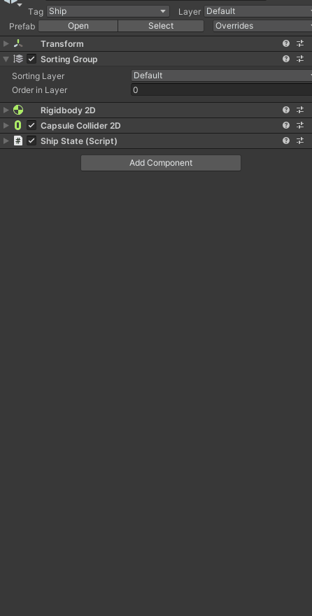

# Ship Game #
This game was made in Unity **2021.3.5f1**.

To start the project open the scene _Root under Assets/Scenes/_Root.scene, the scene only has 2 objects GameManager and EventSystem, if you select the GameManager object you will see shortcuts for the other scenes.

If you try to open a scene without the _Root scene being loaded or if you try to open another scene and unload the _Root scene, the editor will warn you about it.

As long as the _Root scene is loaded you can start the game with any set of scenes, the GameManager will take care to only keep the ones necessary without causing any errors.

## Features ##
The game itself is quite simple and so there are no groundbreaking features, but still, these are some of the features in the game and the inspector that I think deserve some mentioning, there are both in-game and in-editor features that I will be listing but fell free to explore the project and see the others.

## In Game ##
The game can detect the input device and adjust the UI accordingly.

Enemies can avoid obstacles no matter size or rotation, to pursue the player.

## Inspector ##
Starting by the enemy spawner, you can easily setup the chance of each type of enemy to spawn by adjusting it in the inspector with a similar layout of the one used in the LOD component.

The available areas to spawn are also easy to select and modify, being able to select them directly from the game scene.

For the enemies them self you can easily adjust the area around the player where the ship will try to circle to attack, represented by the red circle.

The component itself also brings all the components preset so it's easy to create new enemies.

